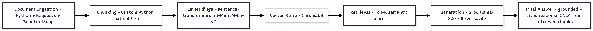

# Project 1 Planning: The Unofficial Guide

> Write this document before you write any pipeline code.
> Your spec and architecture diagram are what you'll use to direct AI tools (Claude, Copilot, etc.) to generate your implementation — the more specific they are, the more useful the generated code will be.
> Update the Retrieval Approach and Chunking Strategy sections if you change your approach during implementation.
> Update this file before starting any stretch features.

---

## Domain
I chose the domain of student experiences and reviews about Georgia State University's Computer Science program, courses, and professors. This information is valuable because students often want to know what classes and professors are really like before registering, including workload, difficulty, and teaching style. It can be hard to find because these experiences are usually shared across Reddit posts, review websites, and online discussions instead of official university pages.

---

## Documents

<!-- List your specific sources: URLs, subreddit names, forum threads, or file descriptions.
     Aim for at least 10 sources that together cover different subtopics or perspectives within your domain. -->

| # | Source | Description | URL or location |
|---|--------|-------------|-----------------|
| 1 | GSU page | List of CS professors | https://csds.gsu.edu/directory/ |
| 2 | GSU page | CS program requirements | https://catalogs.gsu.edu/preview_program.php?catoid=42&poid=12378&utm_source=ppcatalog&utm_medium=cas&utm_content=bs&utm_campaign=program_explorer |
| 3 | GSU page | List of CS programs and courses at GSU| https://catalogs.gsu.edu/preview_entity.php?catoid=42&ent_oid=2867 |
| 4 | Reddit | Comparing GSU's CS program | https://www.reddit.com/r/GaState/comments/17tazvq/how_is_the_computer_science_program/ |
| 5 | Reddit | Worst CS professors at GSU| https://www.reddit.com/r/GaState/comments/1j1jp7q/worst_cs_professor_youve_had_off_the_top_of_your/ |
| 6 | Reditt | Best CS professors at GSU| https://www.reddit.com/r/GaState/comments/1j2qjrw/best_cs_profs_at_gsu/ |
| 7 | Reditt | GSU CS program review| https://www.reddit.com/r/GaState/comments/p02fn2/how_good_is_the_cs_program_at_gastate/ |
| 8 | RateMyProfessors| Rates CS professors at GSU| https://www.ratemyprofessors.com/search/professors/360?q=*&did=11 |
| 9 | Coursicle| CS course reviews|https://www.coursicle.com/gsu/courses/CSC/ |
| 10 | Quora| Easy classes for CS program | https://www.quora.com/I-am-doing-my-undergrad-in-Georgia-State-University-currently-in-my-sophomore-year-majoring-in-computer-science-I-need-12-credits-from-any-2000-4000-level-classes-Can-someone-please-recommend-some-easy-general-2000 |

---

## Chunking Strategy

<!-- How will you split documents into chunks?
     State your chunk size (in tokens or characters), overlap size, and explain why those
     numbers fit the structure of your documents.
     A review-heavy corpus warrants different chunking than a long FAQ. -->

**Chunk size:**
300 words

**Overlap:**
50 words

**Reasoning:**
I will split documents into chunks of approximately 300 words with an overlap of 50 words. This size is large enough to preserve the context of student reviews and discussion posts while still allowing the retrieval system to find specific information about professors, courses, and the computer science program. My document collection contains a mix of short reviews, Reddit discussions, and longer university information pages. Using overlapping chunks helps prevent important information from being separated when a key idea appears near the boundary between two chunks. If chunks are too small, retrieval may miss important context and return incomplete answers. If chunks are too large, retrieval may return irrelevant information and make it harder to find the most relevant content for a user's question.

---

## Retrieval Approach

<!-- Which embedding model are you using (e.g., all-MiniLM-L6-v2 via sentence-transformers)?
     How many chunks will you retrieve per query (top-k)?
     If you were deploying this for real users and cost wasn't a constraint, what tradeoffs
     would you weigh in choosing a different embedding model — context length, multilingual
     support, accuracy on domain-specific text, latency? -->

**Embedding model:**
all-MiniLM-L6-v2 via sentence-transformers

**Top-k:**
Top 5 most relevant chunks

**Production tradeoff reflection:**
If I were deploying this system for real users and cost was not a concern, I would consider larger embedding models that provide higher retrieval accuracy, better support for longer documents, and stronger performance on domain-specific or multilingual text, while balancing latency and computational requirements.

---

## Evaluation Plan

<!-- List your 5 test questions with their expected correct answers.
     Questions should be specific enough that you can judge whether the system's response
     is right or wrong. "What are good dining halls?" is too vague.
     "What do students say about wait times at [dining hall name] during lunch?" is testable. -->

| # | Question | Expected answer |
|---|----------|-----------------|
| 1 | What do students say about the quality of Georgia State University's Computer Science program? | Students generally describe the CS program more positively than its reputation suggests. Several students believe that success in the program depends heavily on personal effort, participation, and taking advantage of opportunities such as office hours, research, and internships. They also mention that upper-level professors tend to be better and that the program prepares students well for software engineering careers. | 
| 2 | What issues do students report about Tushara Sadasivuni’s Software Development class? | Students report that the class is disorganized, lectures are read directly from slides, labs can be difficult without prior Java experience, and instructions are sometimes missing or unclear. Some also mention TAs arriving late and inconsistent lab guidance. |
| 3 | Which CS professor is most consistently praised in student discussions, and what qualities are mentioned? | William Johnson is the most consistently praised professor, with students describing him as passionate, caring, fair, and effective at teaching. He is frequently mentioned as a top choice among CS instructors at Georgia State. |
| 4 | What are the main requirements students must complete before they can take upper-level CS courses (CSC 2720 and above)? | Students must earn a C or higher in CSC 1301 and CSC 1301L, and complete either CSC 2510 or MATH 2420, plus a required math course (such as MATH 1113, MATH 2211, MATH 2212, or MATH 2215). They must also achieve a 2.5 GPA across these initial courses to become eligible for upper-level CS classes. |
| 5 | What are two advanced CS elective topics listed in the catalog? | Artificial Intelligence (CSC 4810), Machine Learning (CSC 4850), Cloud Computing (CSC 4311), and Big Data Programming (CSC 4760). |

---

## Anticipated Challenges

<!-- What could go wrong? Name at least two specific risks with reasoning.
     Consider: noisy or inconsistent documents, missing source attribution, off-topic
     retrieval, chunks that split key information across boundaries. -->

1. Some of the Reddit and review sources contain noisy or inconsistent information, including opinions, sarcasm, and off-topic comments. This could make it difficult for the retrieval system to consistently extract accurate or relevant chunks, leading to mixed or biased answers depending on which comments are retrieved.

2. Important information may be split across chunk boundaries, especially in longer Reddit threads or official catalog pages. If chunking is not aligned well with how information is structured, the model may miss key context or fail to combine related details, resulting in incomplete or incorrect responses.

---

## Architecture

<!-- Draw a diagram of your pipeline showing the five stages:
     Document Ingestion → Chunking → Embedding + Vector Store → Retrieval → Generation
     Label each stage with the tool or library you're using.
     You can use ASCII art, a Mermaid diagram, or embed a sketch as an image.
     You'll use this diagram as context when prompting AI tools to implement each stage. -->

---

## AI Tool Plan

<!-- For each part of the pipeline below, describe:
     - Which AI tool you plan to use (Claude, Copilot, ChatGPT, etc.)
     - What you'll give it as input (which sections of this planning.md, which requirements)
     - What you expect it to produce
     - How you'll verify the output matches your spec

     "I'll use AI to help me code" is not a plan.
     "I'll give Claude my Chunking Strategy section and ask it to implement chunk_text()
     with my specified chunk size and overlap" is a plan. -->

**Milestone 3 — Ingestion and chunking:**

**Milestone 4 — Embedding and retrieval:**

**Milestone 5 — Generation and interface:**
